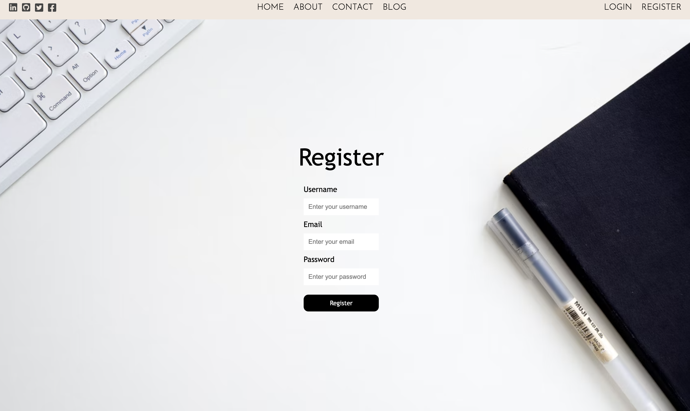
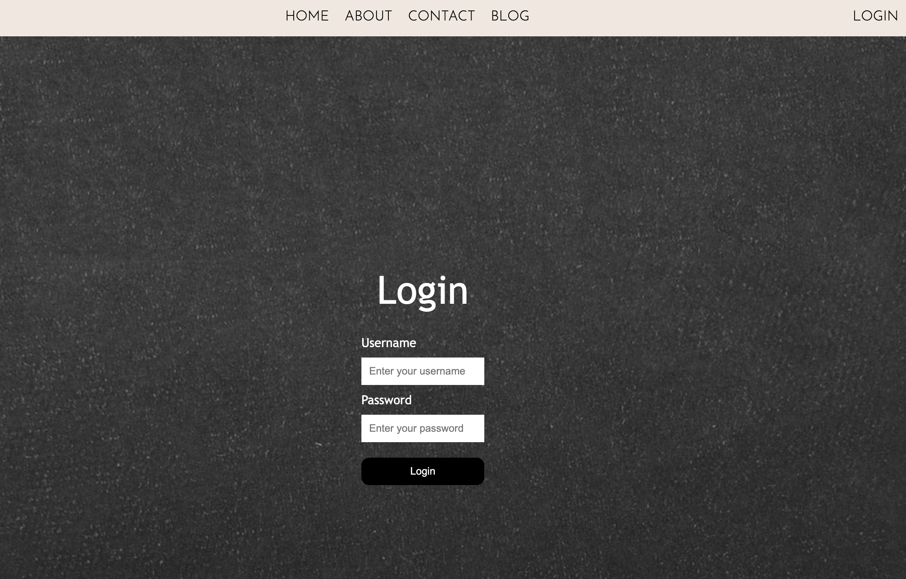
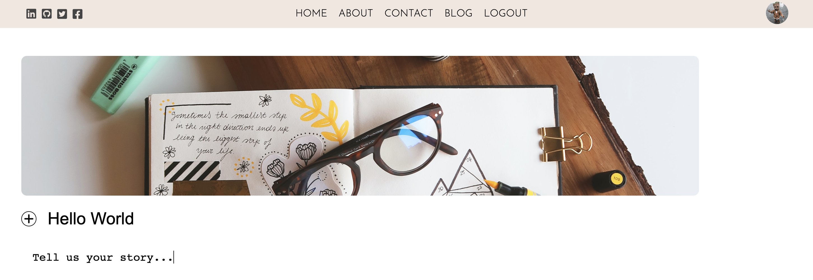

# **U2Blog**

## Table of Contents

- [Description](#Description)
- [Demo](#demo)
- [User Story](#user-story)
- [Getting Started](#getting-started)
- [Technologies](#technologies)
- [Future Improvements](#future-improvements)

## Description

---

U2Blog is the ultimate blogging platform which allows users to share their ideas, thoughts, experiences, and much more. This web application was developed using MERN stack with Sass. 

## Demo

---

Here are some of the demo pictures from U2Blog web application.

Deployed Website:https://ublog2app.herokuapp.com/

## User Story

---

As a user, I want to write and post blogs, so that I can share my experiences with the world. 

## Getting Started

---

You must register first then log in using your username and password in order to create and share any posts. 

## Technologies

---

- React
- Node.js
- Express
- MongoDB
- Mongoose
- Sass
- Heroku
- Google Fonts
- Figma
- Fontawesome

## Future Improvements

---

For future improvements I will include...

- Use React redux to improve the performance of the web app. 
- Fix minor bugs, ex. delete account button.
- Link the category to the created post and pull them all together in a single page. 
- Work on contact me page.
